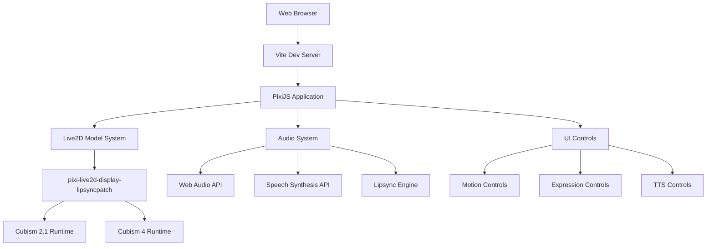
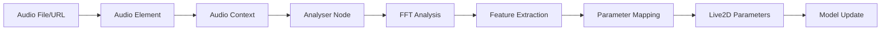

# System Architecture

This document provides a comprehensive overview of the VTuber Game framework architecture, explaining how all components work together to create a powerful Live2D application with lipsync capabilities.

## 🏗️ High-Level Architecture



## 🧩 Core Components

### 1. PixiJS Application Layer

**Location**: `src/main.js` - `init()` function

The foundation of the entire system, responsible for:

```javascript
// Application initialization
app = new Application({
  view: canvas,
  width: 800,
  height: 600,
  backgroundColor: 0x1099bb,
  antialias: true,
  autoDensity: true,
  resolution: window.devicePixelRatio || 1,
});
```

**Responsibilities**:
- Canvas management and rendering
- Scene graph management
- Render loop and ticker integration
- Device pixel ratio handling
- WebGL context management

### 2. Live2D Model System

**Location**: Throughout `src/main.js`

The core Live2D integration using the patched library:

```javascript
import { Live2DModel } from 'pixi-live2d-display-lipsyncpatch';

// Register ticker for model updates
Live2DModel.registerTicker(Ticker);
```

#### Key Components:

**Model Loading (`loadModel` function)**:
```javascript
async function loadModel(modelPath, modelName) {
  // Model cleanup
  if (model) {
    app.stage.removeChild(model);
    model.destroy();
  }
  
  // Load new model
  model = await Live2DModel.from(modelPath);
  app.stage.addChild(model);
  
  // Positioning and scaling
  model.scale.set(0.3);
  model.x = app.screen.width / 2;
  model.y = app.screen.height * 0.8;
  model.anchor.set(0.5, 1.0);
}
```

**Model Information Management**:
- Motion manager integration
- Expression system
- Model metadata extraction
- Performance monitoring

### 3. Audio and Lipsync System

The most complex part of the architecture, handling multiple audio sources:

#### A. Text-to-Speech Integration

```javascript
function speakText(text) {
  const utterance = new SpeechSynthesisUtterance(text);
  
  // Voice selection logic
  const voices = speechSynthesis.getVoices();
  const femaleVoice = voices.find(voice => 
    voice.name.toLowerCase().includes('female')
  );
  
  // Motion synchronization
  utterance.onstart = () => {
    triggerRandomMotion('tapBody') || 
    triggerRandomMotion('idle');
  };
}
```

#### B. Audio File Lipsync

```javascript
// Enhanced speak function from the patch
model.speak(audioPath, {
  volume: 1.0,
  expression: 4,
  resetExpression: true,
  crossOrigin: 'anonymous',
  onFinish: () => console.log('Speech completed'),
  onError: (err) => console.error('Audio error:', err)
});
```

#### C. Lipsync Engine (Patch Implementation)

The patched library includes:
- **Audio Analysis**: Real-time frequency analysis
- **Parameter Mapping**: Audio features to mouth parameters
- **Timing Synchronization**: Frame-accurate lip movement
- **Expression Management**: Preserving facial expressions during speech

### 4. User Interface System

**Location**: `index.html` + `src/style.css` + control functions in `src/main.js`

#### HTML Structure:
```html
<div id="app">
  <canvas id="canvas"></canvas>
  <div id="controls">
    <div id="model-selector">...</div>
    <div id="motions">...</div>
    <div id="expressions">...</div>
    <div id="tts-controls">...</div>
    <div id="model-info">...</div>
  </div>
</div>
```

#### Dynamic Control Generation:

**Motion Controls (`setupMotionControls`)**:
```javascript
function setupMotionControls(motionManager) {
  Object.keys(motionManager.definitions).forEach(groupName => {
    const motions = motionManager.definitions[groupName];
    motions.forEach((motion, index) => {
      const button = document.createElement('button');
      button.onclick = () => model.motion(groupName, index);
    });
  });
}
```

**Expression Controls (`setupExpressionControls`)**:
```javascript
function setupExpressionControls(expressionManager) {
  expressionManager.definitions.forEach((expression, index) => {
    const button = document.createElement('button');
    button.onclick = () => model.expression(index);
  });
}
```

## 🔧 The Lipsync Patch Deep Dive

### What is Patched?

The `pixi-live2d-display-lipsyncpatch` library extends the original `pixi-live2d-display` with:

1. **Enhanced `speak()` Method**
2. **Audio Analysis Engine**
3. **Parameter Mapping System**
4. **CORS Handling**
5. **Callback System**

### Audio Processing Pipeline



### Implementation Details

**Audio Context Setup**:
```javascript
// Simplified patch implementation concept
const audioContext = new AudioContext();
const analyser = audioContext.createAnalyser();
const source = audioContext.createMediaElementSource(audioElement);

source.connect(analyser);
analyser.connect(audioContext.destination);
```

**Real-time Analysis**:
```javascript
// Continuous audio analysis
function updateLipsync() {
  const dataArray = new Uint8Array(analyser.frequencyBinCount);
  analyser.getByteFrequencyData(dataArray);
  
  // Extract audio features
  const volume = calculateVolume(dataArray);
  const formants = extractFormants(dataArray);
  
  // Map to Live2D parameters
  model.internalModel.coreModel.setParameterValueById(
    'ParamMouthOpenY', 
    mapVolumeToMouth(volume)
  );
}
```

## 🗂️ File Organization

### Source Code Structure

```
src/
├── main.js           # Main application logic
│   ├── init()                    # App initialization
│   ├── loadModel()              # Model loading
│   ├── setupModelControls()     # UI setup
│   ├── speakText()              # TTS integration
│   ├── triggerRandomMotion()    # Motion control
│   └── debugModel()             # Debug utilities
├── style.css         # UI styling
└── counter.js        # Utility functions
```

### Asset Organization

```
public/
├── core/             # Live2D runtime files
│   ├── live2d.min.js           # Cubism 2.1 runtime
│   └── live2dcubismcore.js     # Cubism 4 runtime
└── models/           # Model assets
    ├── shizuku/              # Cubism 2.1 model
    │   ├── shizuku.model.json
    │   ├── textures/
    │   ├── motions/
    │   └── sounds/
    └── haru/                 # Cubism 4 model
        ├── haru_greeter_t03.model3.json
        ├── textures/
        └── motions/
```

## 🔄 Data Flow

### Model Loading Flow

1. **User Interaction**: Button click triggers `loadModel()`
2. **Cleanup**: Previous model removed and destroyed
3. **Loading**: `Live2DModel.from()` loads model data
4. **Integration**: Model added to PixiJS stage
5. **Setup**: Controls and info panels populated
6. **Ready**: Model ready for interaction

### Animation Flow

1. **Trigger**: User clicks motion button
2. **Validation**: Check if model is loaded
3. **Execution**: `model.motion()` called
4. **Processing**: Internal animation system handles playback
5. **Rendering**: PixiJS renders animated frames

### Lipsync Flow

1. **Input**: Audio file URL or TTS text
2. **Audio Setup**: Audio element created/configured
3. **Analysis**: Real-time audio processing begins
4. **Parameter Update**: Mouth parameters updated per frame
5. **Expression Management**: Facial expressions preserved
6. **Cleanup**: Audio and analysis stopped on completion

## ⚡ Performance Considerations

### Rendering Optimization

- **Manual Render Triggers**: `app.render()` called strategically
- **Efficient Scaling**: Models scaled to 30% for optimal performance
- **Smart Anchoring**: Center-bottom anchoring reduces calculations

### Memory Management

- **Model Cleanup**: Previous models properly destroyed
- **Audio Cleanup**: Audio contexts and elements cleaned up
- **Event Listener Management**: Proper cleanup of event handlers

### Audio Performance

- **Efficient Analysis**: Optimized FFT processing
- **Parameter Caching**: Avoid redundant parameter updates
- **CORS Optimization**: Proper cross-origin handling

## 🔗 Integration Points

### External Dependencies

- **PixiJS**: Core rendering engine
- **Live2D Runtimes**: Cubism 2.1 and 4 support
- **Web APIs**: Audio Context, Speech Synthesis
- **Vite**: Development and build tooling

### Extension Points

- **Custom Models**: Easy model addition system
- **Motion Libraries**: Extensible motion system
- **Audio Sources**: Multiple audio input methods
- **UI Themes**: Customizable interface styling

## 📊 Debug and Monitoring

### Built-in Debug Tools

```javascript
// Debug function available in console
function debugModel() {
  console.log('Model visible:', model.visible);
  console.log('Model position:', { x: model.x, y: model.y });
  console.log('Model bounds:', model.getBounds());
  console.log('Canvas size:', { 
    width: app.view.width, 
    height: app.view.height 
  });
}
```

### Performance Monitoring

- Model dimensions logging
- Animation state tracking
- Audio processing metrics
- Render performance stats

---

This architecture enables a flexible, performant Live2D application that can be extended with additional features while maintaining clean separation of concerns.